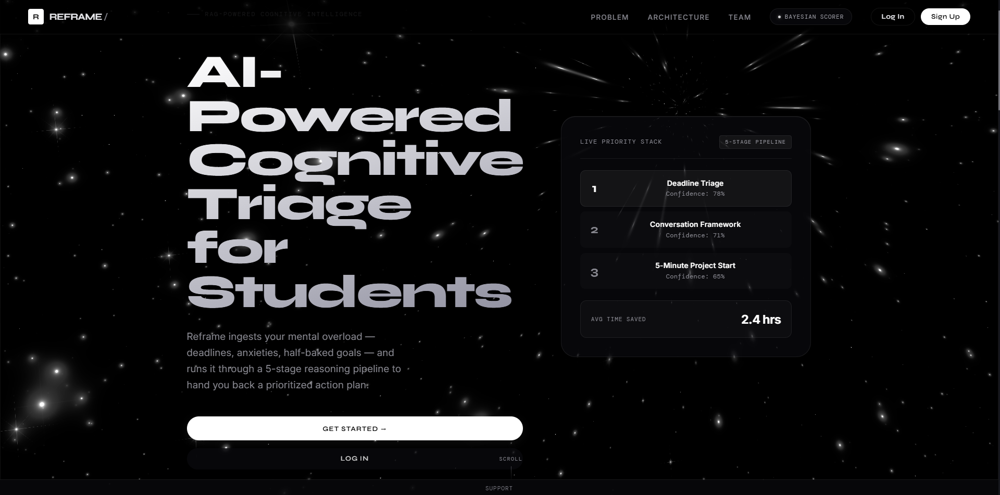
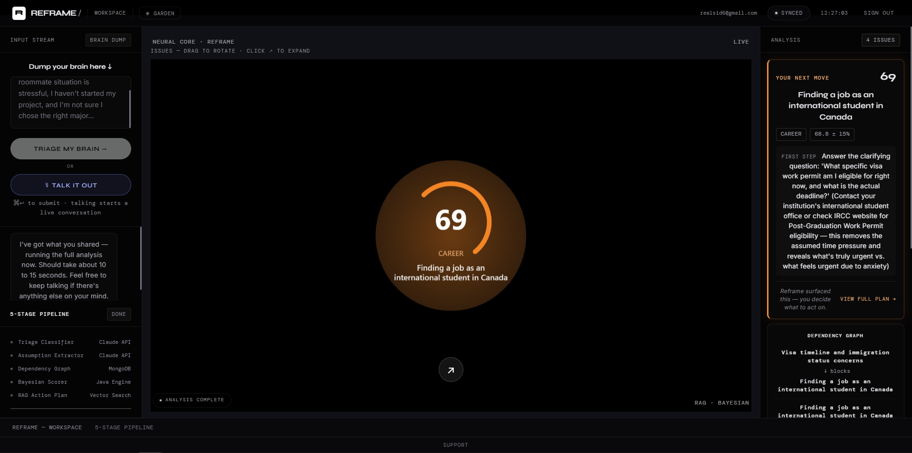

# Reframe

   

AI-powered cognitive triage for overwhelmed students. Talk or type out everything that's stressing you out — Reframe runs it through a 5-stage reasoning pipeline and hands back one clear, confidence-scored next move, not a wall of reorganized chaos.

Built for [USAII's Global AI Hackathon 2026](https://aihackathon.usaii.org/).

**[Watch the demo](https://youtu.be/i5htORaUKBk)** · **[Devpost submission](https://devpost.com/software/reframe-of3glt?ref_content=user-portfolio&ref_feature=in_progress)** · Live deployment coming soon




## What it does

You dump your mental overload by voice or text. The pipeline:

1. **Triage** — splits the dump into distinct issues and classifies each (urgency, cognitive weight, actionability, category).
2. **Hidden Assumptions** — surfaces what's implied but unstated in each issue, one Claude call per issue for depth over breadth.
3. **Dependency Graph** — maps which issues block, cause, or relate to each other.
4. **Scoring** — computes priority with deterministic Java math, not an AI guess, then asks Claude to narrate the *already-computed* score in two sentences. The number is reproducible and auditable; the AI only explains it.
5. **RAG Action Plan** — embeds the issue with Voyage AI, retrieves the closest-matching framework from a small corpus of real, established methods (GTD, CBT cognitive defusion, the Eisenhower Matrix, and others) by cosine similarity, and generates a plan grounded in that framework specifically.

You get back a prioritized, explainable list of issues, a dependency graph, and one surfaced "next move."

## What makes this different from a ChatGPT wrapper

- **Real RAG, not a hardcoded lookup table.** Retrieval is driven by actual vector embeddings and cosine similarity over a real framework corpus, not a fixed category-to-advice map.
- **Explainable scoring.** Priority scores are plain arithmetic (`urgency * 0.4 + cognitiveWeight * 0.6`, scaled by feasibility and graph impact), never an opaque AI-generated number.
- **Human-in-the-loop that's actually real.** Rejecting one of the AI's inferred assumptions about you isn't cosmetic — it's persisted server-side via a dedicated endpoint and recomputes your confidence interval for real.
- **Voice and text are equally first-class.** The conversational voice agent and the type-it-out path both feed the same pipeline; neither is a fallback for the other.
- **Hand-rolled WebGL2 visualization.** The sphere of issues is raw WebGL2 with custom shaders and instanced rendering, not a Three.js / React Three Fiber wrapper.

## Architecture

```
React (Vite) ──REST/JSON──▶ Spring Boot ──▶ Claude API      (reasoning: extraction, judgment, language)
                                       ├──▶ Voyage AI        (embeddings for RAG retrieval)
                                       ├──▶ ElevenLabs       (text-to-speech)
                                       └──▶ MongoDB          (persistence)
```

Voice input runs entirely in-browser via the Web Speech API (free, no extra service); voice *output* is the only piece that goes through ElevenLabs.

## Tech stack

| Layer | Technology |
|---|---|
| Backend | Java 25, Spring Boot 4.1, Spring Security 7, Spring Data MongoDB |
| Frontend | React 18, Vite, hand-rolled WebGL2 |
| AI reasoning | Claude API (Anthropic) |
| Retrieval | Voyage AI embeddings (`voyage-3-lite`), cosine similarity |
| Voice | Web Speech API (input), ElevenLabs (output) |
| Auth | JWT |
| Database | MongoDB Atlas |

## Getting started

**Backend**
```bash
cp src/main/resources/application.properties.example src/main/resources/application.properties
# fill in your own MongoDB URI, Claude/Voyage/ElevenLabs keys, and JWT secret
./mvnw spring-boot:run
```

**Frontend**
```bash
cd frontend
npm install
npm run dev
```

The app expects the backend on `:8080` and the frontend dev server on `:5173`.

## Team

Built by [Sidharth Nair](https://github.com/sidharthnair7) and [Basudev Biju](https://github.com/basudevbiju).
